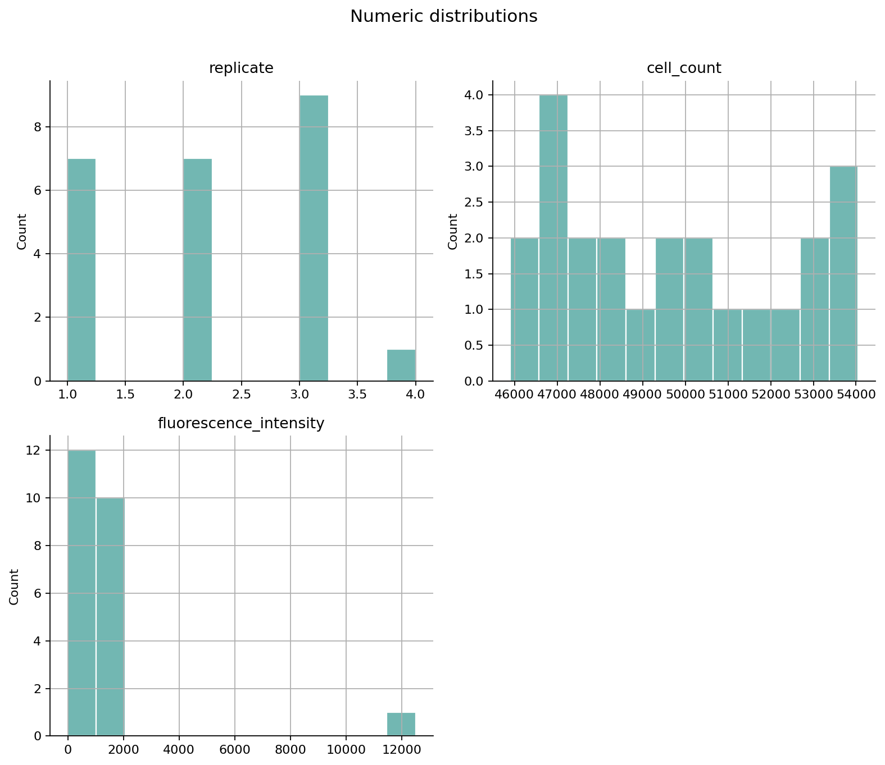

# Experimental Data QC

A quality-control tool for biology experiment data. It checks a CSV for common problems before statistical analysis and produces a readable report, a row-level issues file, and diagnostic plots.

The included example mimics a fluorescence assay with control and treatment groups. All example records are synthetic.

## What it checks

- missing values in required columns
- duplicate sample IDs and duplicate rows
- numeric values outside biologically plausible ranges
- statistical outliers using the IQR rule
- inconsistent categorical labels such as `Control`, `control`, and `CTRL`
- unexpected sample counts across experimental groups

## Example output

```text
QC status: WARNING
Rows checked: 24
Issues found: 21

missing_required       2
duplicate_id           2
out_of_range           2
statistical_outlier    1
inconsistent_label     9
```



Running the tool creates:

```text
qc_output/
├── qc_report.md
├── qc_issues.csv
├── missing_values.png
└── numeric_distributions.png
```

## Quick start

Requires Python 3.10 or newer.

```bash
python -m venv .venv
source .venv/bin/activate       # Windows: .venv\Scripts\activate
pip install -e .

experimental-qc data/example_fluorescence.csv \
  --config data/example_config.json \
  --output qc_output
```

To run it on an arbitrary CSV without a configuration file:

```bash
experimental-qc my_experiment.csv --output qc_output
```

## Configuration

The optional JSON configuration defines experiment-specific expectations:

```json
{
  "id_column": "sample_id",
  "required_columns": ["sample_id", "condition", "fluorescence_intensity"],
  "numeric_ranges": {
    "fluorescence_intensity": {"min": 0, "max": 5000}
  },
  "categorical_columns": ["condition"],
  "group_column": "condition",
  "expected_group_size": {"min": 5, "max": 20},
  "outlier_columns": ["fluorescence_intensity"],
  "outlier_iqr_multiplier": 1.5
}
```

Range limits should come from the assay protocol or domain knowledge. IQR outliers are flags for review, not automatic reasons to delete observations.

## Project structure

```text
experimental-data-qc/
├── data/                  # synthetic demo data and config
├── src/experimental_qc/   # reusable QC package and CLI
├── tests/                 # unit tests
├── .github/workflows/     # automated tests on every push
├── pyproject.toml
└── README.md
```

## Testing

```bash
pip install -e '.[dev]'
pytest
```

## Responsible use

This tool supports human review; it does not decide whether an observation should be excluded. Document any exclusion criteria before examining experimental outcomes.

## License

MIT
